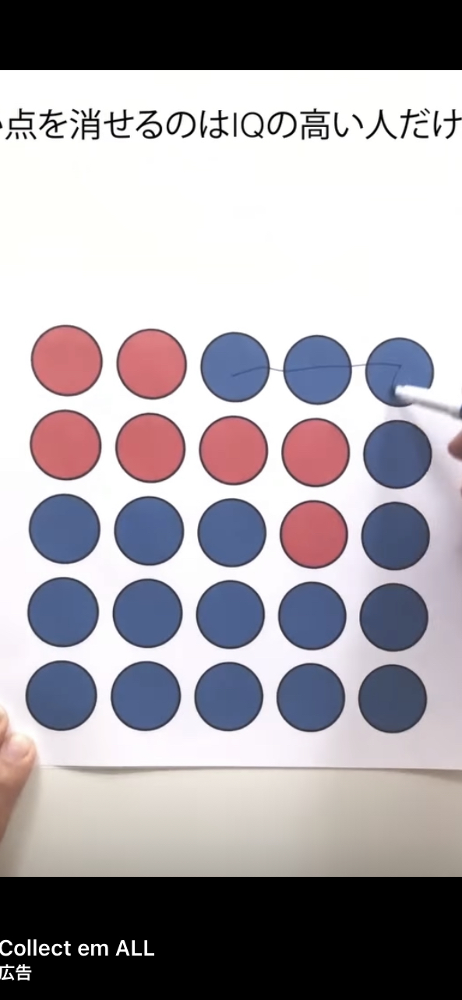

# SolveOneStrokePuzzleTest
I found this puzzle in an internet advertisement.  
This is an algorithm that tries to solve this by brute force.  



# The Rules of The Game
1. You need to trace the all blue circles
2. You can only trace the blue circles that are continuous from side to side and up and down
3. You can't trace the blue circles which you traced once again

# How to Use This Program
```terminal
$ python main.py
1 1 0 0 0 
1 1 1 1 0 
0 0 0 1 0 
0 0 0 0 0 
0 0 0 0 0 
This puzzle can not be solved.
```

# Conclusion
**This puzzle cannot be solved!!**  

